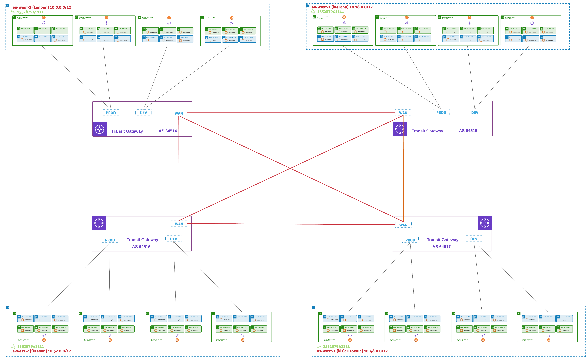

# aws-poc


The purpose of this repository is to test the deployment of infrastructure in AWS and keep learning.

## Overview

This project builds a global network architecture using AWS Transit Gateway spanning multiple regions. The infrastructure is managed using Terraform modules with environment-specific configurations.

## Architecture

In our first iteration, we will build a Global Network based on the diagram below:



## Project Structure

```text
├── docs/              # Documentation
├── modules/           # Reusable Terraform modules
│   └── create-vpc/    # VPC creation module
├── envs/              # Environment-specific configurations
│   └── dev/           # Development environment
│       └── euw2/      # EU West 2 region
├── vars/              # Shared variable definitions
└── resources/         # Documentation assets
```

## Quick Start

For detailed setup and deployment instructions, see:

- **[Getting Started Guide](docs/getting-started.md)** - Prerequisites, initial setup, and development workflow
- **[Deployment Instructions](docs/deployment.md)** - Step-by-step deployment guide and troubleshooting

## CI/CD Pipeline

The project includes a GitHub Actions pipeline that:

- Runs on pushes to `main` and pull requests
- Generates cost estimates using Infracost
- Posts cost analysis comments on pull requests

## Modules

- **create-vpc**: Creates VPC with public/private subnets, route tables, and NAT gateways

See the [Deployment Guide](docs/deployment.md) for detailed module usage examples.

## TO-DO

- Pipelines:
  - Terraform Format
  - TF Linting
  - Docs generation with Terraform Docs
- Add Transit Gateway module
- Multi-region deployment automation
- Enhanced monitoring and logging
- Tools
  - AWS Clound Control Provider
  - Deployment Scripts (via Taskfile)
