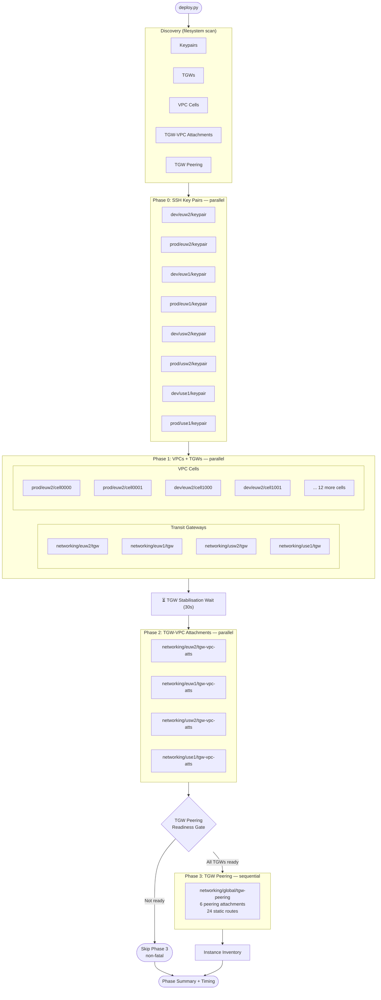

# Deployment

## Overview

The deployment is orchestrated by `scripts/deploy.py`, a Python CLI that discovers Terraform directories from the filesystem and deploys them in phased order. Each phase has dependency constraints — later phases depend on resources created by earlier ones.

All phases use `terraform init` + `terraform apply -auto-approve` (or `terraform plan` in dry-run mode). Logs are written per-directory to `logs/<timestamp>/`.

## Deployment Phases



## Phase Details

### Phase 0: SSH Key Pairs (parallel)

Deploys SSH key pairs for each environment/region combination. These are needed by EC2 instances in Phase 1. All keypair directories run in parallel via `ThreadPoolExecutor`.

- Directories: `envs/{dev,prod}/{euw2,euw1,usw2,use1}/keypair/`
- Dependencies: None
- Parallelism: All directories run concurrently

### Phase 1: VPCs + TGWs (parallel)

Deploys Transit Gateways and all VPC cells simultaneously. TGWs and VPCs have no inter-dependencies at creation time, so they can all run in parallel.

- TGW directories: `envs/networking/{euw2,euw1,usw2,use1}/tgw/`
- VPC directories: `envs/{dev,prod}/{euw2,euw1,usw2,use1}/cell*/`
- Dependencies: Phase 0 (key pairs must exist for EC2 instances)
- Parallelism: All TGWs + all VPCs run concurrently

After Phase 1 completes, a 30-second stabilisation wait allows TGWs to become fully available before attaching VPCs.

### Phase 2: TGW-VPC Attachments (parallel)

Attaches each VPC to its region's Transit Gateway and associates it with the correct route table (prod or dev) based on the cell's environment tag.

- Directories: `envs/networking/{euw2,euw1,usw2,use1}/tgw-vpc-atts/`
- Dependencies: Phase 1 (TGWs and VPCs must exist)
- Parallelism: All attachment directories run concurrently

Each directory uses `terraform_remote_state` to read VPC and TGW outputs, then creates attachments, route table associations, and VPC-side static routes (`10.0.0.0/8 → TGW`).

### Peering Readiness Gate

Before Phase 3, the script checks that all 4 TGW states are accessible in S3. It parses `data.tf` in the peering directory to find all `terraform_remote_state` blocks referencing TGW state files, then verifies each one has a valid `transit_gateway.id` output.

If any TGW is not ready (e.g. you only deployed 2 regions), Phase 3 is skipped with a non-fatal warning. Use `--force-peering` to bypass.

### Phase 3: TGW Peering (sequential)

Deploys the full-mesh TGW peering across all 4 regions. This is a single `terraform apply` on `envs/networking/global/tgw-peering/` that creates:

- 6 peering attachments (full mesh: euw2↔euw1, euw2↔usw2, euw2↔use1, euw1↔usw2, euw1↔use1, usw2↔use1)
- 12 WAN route table associations (2 per attachment)
- 24 static routes (prod + dev on each side of each attachment)
- 6 `time_sleep` resources (120s each for peering stabilisation)

This phase runs sequentially (single directory) because all peering lives in one Terraform state.

## CLI Usage

```bash
# Full deploy — all regions, all environments
python scripts/deploy.py

# Dry-run (plan only, no changes)
python scripts/deploy.py --dry-run

# Deploy specific regions
python scripts/deploy.py --regions usw2,use1

# Deploy specific environment
python scripts/deploy.py --environment dev

# Skip peering phase
python scripts/deploy.py --skip-peering

# Force peering (bypass readiness gate)
python scripts/deploy.py --force-peering

# Custom TGW stabilisation wait
python scripts/deploy.py --tgw-wait 60
```

## Destroy

The destroy script (`scripts/destroy.py`) runs the phases in reverse order:

1. TGW Peering (sequential)
2. TGW-VPC Attachments (parallel)
3. VPCs + TGWs (parallel)
4. SSH Key Pairs (parallel)

```bash
# Full destroy
python scripts/destroy.py

# Dry-run destroy
python scripts/destroy.py --dry-run

# Destroy specific regions
python scripts/destroy.py --regions usw2,use1
```

## Manual Operations

### Full Deployment Order

```bash
# 1. Deploy VPC with all resources
cd envs/dev/euw2/cell1000/
terraform init && terraform apply

# 2. Deploy Transit Gateway
cd envs/networking/euw2/tgw/
terraform init && terraform apply

# 3. Deploy VPC attachments
cd envs/networking/euw2/tgw-vpc-atts/
terraform init && terraform apply
```

### Complete Teardown

**CRITICAL**: Destroy in reverse order to avoid dependency errors.

#### Step 1: Delete TGW VPC Attachments

```bash
cd envs/networking/euw2/tgw-vpc-atts/
terraform destroy -auto-approve
```

**Deletes**: VPC attachments, route table associations, propagations
**Duration**: ~3 min | **Saves**: $36/month per attachment

#### Step 2: Delete Transit Gateway

```bash
cd envs/networking/euw2/tgw/
terraform destroy -auto-approve
```

**Deletes**: Transit Gateway, route tables (prod/dev/shared)
**Duration**: ~2 min | **Saves**: $36/month

#### Step 3: Delete VPC & All Resources

```bash
cd envs/dev/euw2/cell1000/
terraform destroy -auto-approve
```

**Deletes**:
- 6 EC2 instances (bastion hosts)
- 3 EC2 instances (private hosts)
- NAT Gateway, Internet Gateway, Egress-only IGW
- 6 subnets (3 public, 3 private)
- Route tables, routes, route table associations
- Security groups (bastion, private), NACLs with rules
- SSH key pair (AWS key + local files)
- VPC

**Duration**: ~5-7 min | **Saves**: ~$150-200/month (EC2 + NAT)

### Verification

```bash
# No TGW attachments
aws ec2 describe-transit-gateway-vpc-attachments --region eu-west-2

# No TGW
aws ec2 describe-transit-gateways --region eu-west-2

# No VPC
aws ec2 describe-vpcs --filters "Name=tag:Name,Values=vpc-euw2-dev-cell1000" --region eu-west-2
```

Expected: Empty results `[]` or "not found" errors.
