# CI Pipeline

The GitHub Actions pipeline lives at [`.github/workflows/pipeline.yml`](../../../.github/workflows/pipeline.yml). It runs quality and cost-analysis checks automatically on every pull request and on every push to `main`.

## Triggers

| Event | Jobs that run |
|-------|--------------|
| `pull_request` → `main` | Infracost PR comment, Terraform Docs, Terraform Validate, TFLint, Checkov |
| `push` → `main` | Infracost Baseline Update |
| `workflow_dispatch` | All jobs (manual trigger) |

## Jobs overview

| # | Job | Trigger | Purpose |
|---|-----|---------|---------|
| 1 | **Infracost – PR Comment** | PR | Compares infrastructure costs between `main` and the PR branch, posts a cost-delta comment |
| 2 | **Terraform Docs** | PR | Verifies module `README.md` files are up to date; auto-commits any diff back to the PR |
| 3 | **Terraform Validate** | PR | Runs `terraform validate` across all Terraform directories in parallel |
| 4 | **TFLint** | PR | Lints all Terraform directories in parallel using the AWS ruleset |
| 5 | **Checkov** | PR | Static security analysis; hard-fails on HIGH/CRITICAL, soft-fails on LOW/MEDIUM |
| 6 | **Infracost – Baseline Update** | Push to `main` | Regenerates the cost baseline table after a merge |

## AWS authentication

All jobs that need AWS access use **OIDC** — no long-lived keys are stored. The runner mints a short-lived JWT, exchanges it with AWS STS for temporary credentials scoped to the `github-actions-infracost` role, and those credentials expire when the job ends.

```
Secret required: AWS_OIDC_ROLE_ARN
Role: arn:aws:iam::<YOUR_AWS_ACCOUNT_ID>:role/github-actions-infracost
```

## Pipeline diagram

```mermaid
flowchart TD
    A([fa:fa-code-pull-request Pull Request opened / updated]) --> B{Event type?}
    C([fa:fa-code-branch Push to main]) --> B

    B -- pull_request --> PR_JOBS
    B -- push --> MAIN_JOBS
    B -- workflow_dispatch --> PR_JOBS

    subgraph PR_JOBS[Pull Request Jobs — run in parallel]
        direction TB

        subgraph IC[Job 1 · Infracost PR Comment]
            IC1[Checkout main branch] --> IC2[AWS OIDC auth]
            IC2 --> IC3[infracost breakdown\nbase-cost.json]
            IC3 --> IC4[Checkout PR branch]
            IC4 --> IC5[AWS OIDC auth]
            IC5 --> IC6[infracost diff\npr-cost.json]
            IC6 --> IC7[Post / update PR comment\nwith cost delta]
        end

        subgraph TD[Job 2 · Terraform Docs]
            TD1[Checkout PR branch] --> TD2[terraform-docs check\nacross all modules]
            TD2 --> TD3{Diff found?}
            TD3 -- Yes --> TD4[Auto-commit fix\nback to PR branch]
            TD3 -- No --> TD5[Pass]
        end

        subgraph TV[Job 3 · Terraform Validate]
            TV1[Checkout PR branch] --> TV2[Setup Terraform]
            TV2 --> TV3[Find all .tf dirs\nin bootstrap / envs / modules]
            TV3 --> TV4[terraform init -backend=false\nin parallel]
            TV4 --> TV5[terraform validate\nin parallel]
        end

        subgraph TL[Job 4 · TFLint]
            TL1[Checkout PR branch] --> TL2[Install tflint v0.61.0]
            TL2 --> TL3[tflint --init\ndownload AWS ruleset]
            TL3 --> TL4[Find all .tf dirs\nin bootstrap / envs / modules]
            TL4 --> TL5[tflint --chdir\nin parallel]
        end

        subgraph CK[Job 5 · Checkov]
            CK1[Checkout PR branch] --> CK2[Install uv + Python deps]
            CK2 --> CK3[uv run checkov\n--config-file tools/.checkov.yaml]
            CK3 --> CK4{Severity?}
            CK4 -- HIGH / CRITICAL --> CK5[Hard fail\nblocks merge]
            CK4 -- LOW / MEDIUM --> CK6[Soft fail\nreported only]
            CK4 -- None --> CK7[Pass]
        end
    end

    subgraph MAIN_JOBS[Push to Main Jobs]
        direction TB

        subgraph IB[Job 6 · Infracost Baseline Update]
            IB1[Checkout main] --> IB2[AWS OIDC auth]
            IB2 --> IB3[infracost breakdown\nformat=table]
        end
    end
```



## Job details

### Job 1 — Infracost PR Comment

Runs on every pull request. Generates two cost estimates — one against the base branch (`main`) and one against the PR branch — then diffs them and posts or updates a single comment on the PR showing the monthly cost delta.

See [infracost.md](infracost.md) for configuration details.

### Job 2 — Terraform Docs

Runs on every pull request. Uses the `terraform-docs/gh-actions` action to check that all module `README.md` files reflect the current inputs, outputs, and requirements. If a diff is detected, the action automatically commits the corrected file back to the PR branch (`git-push: true`).

Modules checked:

- `modules/create-ec2`
- `modules/create-key-pair`
- `modules/create-tgw`
- `modules/create-tgw-vpc-attachment`
- `modules/create-vpc`
- `modules/security`

See [terraform-docs.md](terraform-docs.md) for configuration details.

### Job 3 — Terraform Validate

Runs on every pull request. Discovers all directories under `bootstrap/`, `envs/`, and `modules/` that contain `.tf` files (excluding `.terraform/` cache directories), then runs `terraform init -backend=false` and `terraform validate` in parallel across all of them. The `-backend=false` flag prevents any attempt to connect to the S3 state backend.

### Job 4 — TFLint

Runs on every pull request. Installs TFLint v0.61.0 with the AWS ruleset plugin, then lints all Terraform directories in parallel using the shared config at `tools/.tflint.hcl`.

See [tflint.md](tflint.md) for configuration details.

### Job 5 — Checkov

Runs on every pull request. Installs Checkov via `uv` using the version pinned in `pyproject.toml`, then scans all Terraform HCL under the repository root using the config at `tools/.checkov.yaml`.

- **Hard-fail** on HIGH or CRITICAL findings — the job exits non-zero and blocks the PR from merging.
- **Soft-fail** on LOW or MEDIUM findings — these appear in the job log but do not block merging.

See [checkov.md](checkov.md) for configuration details.

### Job 6 — Infracost Baseline Update

Runs on every push to `main`. Re-generates the full cost breakdown for the merged state and prints it as a table to the job log. This keeps the baseline current so the next PR cost diff is accurate.
