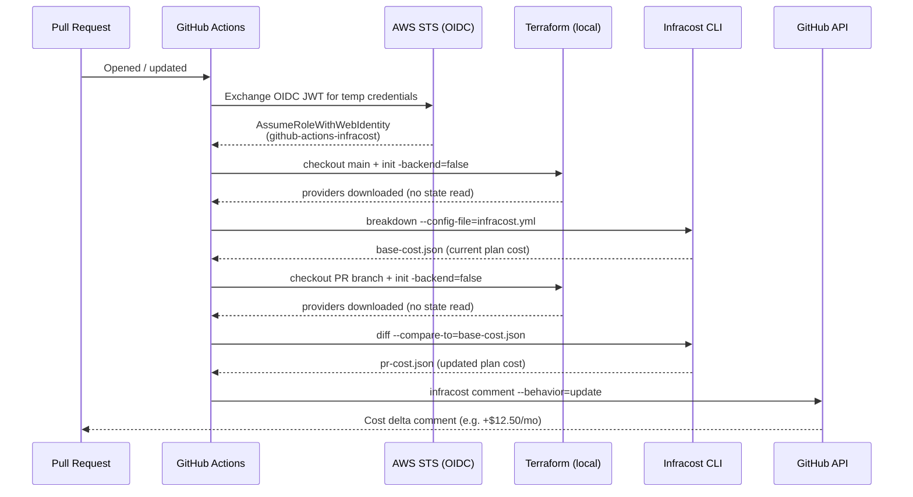

# Infracost

Infracost estimates AWS costs from Terraform HCL — without applying changes or reading remote state.

## How it works

When a PR is opened, the pipeline runs two cost estimates and diffs them:

1. **Baseline** — checks out `main`, runs `terraform init -backend=false` + `terraform plan` on each module
2. **PR diff** — repeats against the PR branch, then compares both JSON outputs
3. **Comment** — posts (or updates) a single PR comment showing the cost delta per project

`-backend=false` means Terraform skips connecting to the S3 state backend entirely. Infracost only needs the provider credentials to parse resource definitions — it never reads or writes state.

## AWS authentication via OIDC

GitHub Actions does not use stored AWS keys. Instead it uses OpenID Connect (OIDC): the runner mints a short-lived JWT, exchanges it with AWS STS for temporary credentials scoped to the role `github-actions-infracost`, and those credentials expire when the job ends.

```
GitHub secret required: AWS_OIDC_ROLE_ARN
Role: arn:aws:iam::796324854413:role/github-actions-infracost
```

## Workflow diagram


